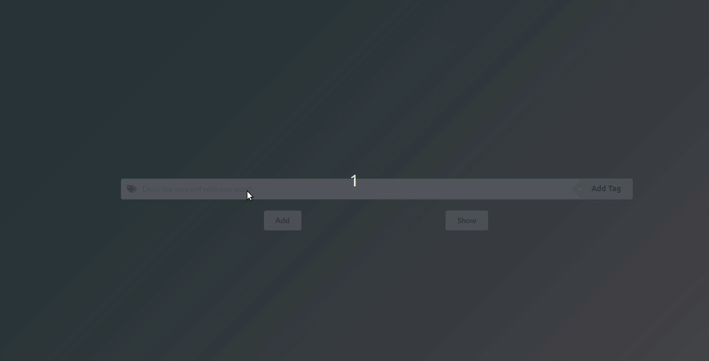

## Interactive User Describer

<a href="https://interactive-words.netlify.app/" target="_blank"><h3 align="left">Click here for demo</h3></a>

## Table of Contents

- [General info](#general-info)
- [Preview](#preview)
- [Technologies](#technologies)
- [Contact](#contact)

## General Info

In this website user will be asked to provide some words to describe him/herself. As soon as 3 words present, user can click on show button to see the results. Please check out the demo!

## Preview

## Technologies

- HTML
- CSS
- Javascript
- React
- Semantic-Ui

## Contact

Created by [eminaydin](https://github.com/eminaydin) - feel free to contact me for any inquiries!
